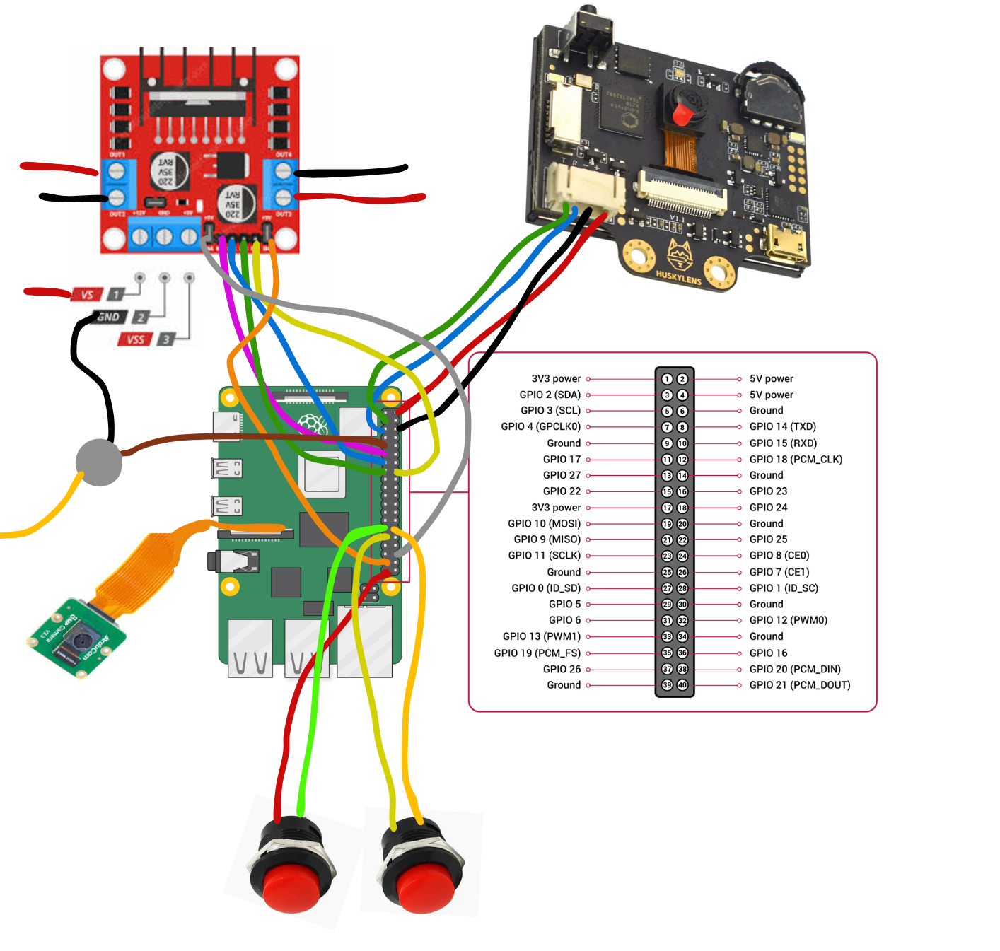

# Instructable: Affirm-A-Clock
**Build an affirmation-based wellbeing alarm clock!**


## 1. Project Summary

Welcome to the Affirm-A-Clock project! This guide will walk you through building a Raspberry Pi-powered robotic wellness coach designed to break the "snooze" button habit and optimise your morning routine. Smartphone alarms are far too easy to ignore. - the classic snooze button actually prolongs sleep inertia, leaving you groggy and disoriented. To tackle this, Affirm-A-Clock forces you to combine physical activity with positive mental health behaviors before the alarm can be silenced. 
**How the Routine Works:** 
* **Wake Up & Move:** When the alarm triggers, you must physically get out of bed and open your curtains to experience natural sunlight. Once the alarm is stopped, the robot tells you your affirmation for the day using a Bluetooth speaker. 
* **Write an Affirmation:** You then write this positive daily affirmation directly onto your window, and underline it using dry-erase markers. 
* **Verification:** You stick the robot to the window (using fan-powered suction), where it follows the line (using HuskyLens line detection) to track your writing and confirms the completion of your handwritten task.
* **Reward & Clean:** The robot congratulates you and announces your new daily streak. Finally, you wipe the window clean, which builds a daily habit of room tidiness (which is tied to mental wellbeing). 

This guide covers the complete mechanical, electrical, and software integration required to build your own Affirm-A-Clock!

**Please Note: As this device is a proof of concept, the window suction mechanism does not yet function entirely. The assembly instructions include its installation for completeness, but strict safety measures and careful setup are required to operate it safely.  If you intend to use the propeller, ensure the safety mesh is attached, that the robot is in an enclosed space and that you are wearing protective gear (goggles, gloves, and lab coat).**

---

## 2. List of Resources Required

### Microcontrollers & Logic
* **1x** Raspberry Pi 4 (Running Raspberry Pi OS)
* **1x** DFRobot HuskyLens (AI Vision Camera)
* **1x** Bluetooth Speaker (For TTS Audio)
* **1x** ArduCam 8MP Camera V2.3

### Motors & Driving
* **1x** HW-095 Motor Controller Driver
* **4x** DC Gear Motors & Wheels (6cm diameter including tires)
* **1x** Brushless DC (BLDC) Drone Motor
* **1x** Electronic Speed Controller (ESC)
* **1x** 7" tri-blade plastic propeller
### Power & Hardware
* **1x** External power supply (6v) to power the wheel motors
* **1x** External power supply (24v) to power the propeller drone motor
* **1x** USB-c power cable to power Raspberry Pi
* Jumper wires (Female-to-Female, Male-to-Female)
* Zip-ties, hot glue or electrical tape for cable management and mounting
* Mounting screws:
	* **10x** 8mm M3 screws (Huskylens, drone motor, HW-095 motor driver)
	* **4x** 8mm M2.5 screws (Raspberry Pi 4)
	* **2x** 16mm M2 screws + M2 nuts (Protective mesh)
	* **2x** 8mm M2 screws + M2 nuts (ArduCam)
	* **1x** M3 nut (propeller)

---

## 3. Pinout & Wiring Guide



For the data and PWM signals to function, the Raspberry Pi must share a **Common Ground** with both the drone motor's ESC and the HW-095 motor controller. 

### The Wiring Table

| Component | Pi Physical Pin | Pi BCM (GPIO) | Purpose |
| :--- | :--- | :--- | :--- |
| **ESC (Drone Motor)** | Pin 12 | GPIO 18 | Hardware PWM Signal (50Hz) |
| **ESC Ground** | Pin 14 | GND | Signal Ground |
| **HW-095 ENA** | Pin 32 | GPIO 12 | Right Motor PWM Speed |
| **HW-095 IN1** | Pin 33 | GPIO 13 | Right Motor Direction A |
| **HW-095 IN2** | Pin 22 | GPIO 25 | Right Motor Direction B |
| **HW-095 ENB** | Pin 37 | GPIO 26 | Left Motor PWM Speed |
| **HW-095 IN3** | Pin 13 | GPIO 27 | Left Motor Direction A |
| **HW-095 IN4** | Pin 8 | GPIO 14 | Left Motor Direction B |
| **HuskyLens SDA** | Pin 3 | GPIO 2 | I2C Data Line |
| **HuskyLens SCL** | Pin 5 | GPIO 3 | I2C Clock Line |
| **Button 1 Terminal A** | Pin 39 | GND | Button 1 Ground |
| **Button 1 Terminal B** | Pin 29 | GPIO 5 | Button 1 Signal Input |
| **Button 2 Terminal A** | Pin 31 | GPIO 6 | Button 2 Signal Input |
| **Button 2 Terminal B** | Pin 30 | GND | Button 2 Ground |

If you want to use the drone motor, ensure you use an ESC, and then connect the motor input signal to the Pi's pin 12, and add the motor's ground connection to the common ground with the pi and HW-095


---

## 5. CAD Design & Mechanical Assembly

The CAD .stl files for the robot frame and the protective lid are hosted on GitHub, accessible here:
-> **https://github.com/UoB-Interactive-Devices/ID26-TeamM-DrHouse**

### Assembly Steps:
1. **Print the Frame:** Start by 3D printing the robot frame and the protective mesh lid.
2. **Wire & Mount the Pi:** Pre-wire the Raspberry Pi 4, and then securely screw it into its mounting points on front of the frame.
3. **Attach the Cameras:** Screw the Arducam into place in its stand, and then mount the HuskyLens at the front of the frame so it has a clear view of the environment.
4. **Mount the Wheels:** Using a hot glue gun, firmly glue the DC wheel motors down onto their designated platforms on the frame.
5. **Install the Motor Controller:** Screw the HW-095 motor driver into the back of the frame. 
6. **Cable Management:** Route all of your wires and cables around the frame of the robot, ensuring they are tucked away from the wheels. You can position the buttons using glue or tape as well.
7. **Mount the Drone Motor:** Securely screw the drone motor into its designated mount in the center of the frame.
8. **Attach the Propeller & Safety Lid:** Carefully attach the propeller to the drone motor and secure using a nut. Immediately screw the protective mesh lid on top to safely enclose the propeller blades.

---

## 6. Software Setup & Configuration

### Install Dependencies
Run these commands in your terminal to install the necessary libraries for the audio engines:
```bash
sudo apt update
sudo apt install build-essential unzip python3-setuptools mpg123 sox -y
pip3 install gTTS gpiozero --break-system-packages
```
----------

## 7. The Code & Software Architecture

All the Python scripts and required libraries are hosted on GitHub. You can download the entire code repository, including the `robot_core.py` script and any necessary libraries, here:
-> **https://github.com/UoB-Interactive-Devices/ID26-TeamM-DrHouse**


### How the Robot Core Code Works
The `robot_core.py` handles hardware interrupts, local AI driving, cloud-based OCR, and Google Drive syncing. Here is a breakdown of its systems:

* **Hardware Inputs & State Management:** The script uses the `gpiozero` library to manage the physical Power and Action buttons. It runs a dedicated background thread to monitor button presses and handle debounce (so that there's only one input per one button press). 
* **Audio & TTS:** The code uses Google Text-to-Speech (`gTTS`) to generate the robot's voice, and caches the audio files locally to ensure immediate playback. To solve the issue where the Pi's audio driver 'sleeps' and misses the beginning of a sound file, the a short, silent 10Hz tone is played immediately before the real audio.
* **Driving and HuskyLens:** The Pi communicates with the HuskyLens with I2C to receive line-tracking vector data (`xHead`, `yHead`, `xTail`). The code calculates the "slant" of the line and categorises the robot into one of 5 states (e.g., straight, soft-turn, hard-correction). It then uses PWM to drive the HW-095 motor controller, adjusting the speed of the left and right wheels to follow the path.
* **Machine Vision & OCR:** While driving, a background thread uses `Picamera2` to snap photos of the floor every 0.5 seconds. Once the run finishes, the code takes these overlapping photos, stitches them together into image strips using the `PIL` (Pillow) library, boosts the contrast, and sends them to a multimodal AI model using the OpenRouter API.
* **AI Evaluation (The Judge):** Once the OCR returns the text it read from the floor, the script makes a second API call to an LLM. It passes the target affirmation and the detected text, asking the LLM to act as a lenient judge to determine a "PASS" or "FAIL", ignoring minor spelling or handwriting errors.
* **Google Drive Sync & Streak Tracking:** If you pass, the script uses the `google-auth` library to connect to your personal Google Drive. It reads the final line of an `affirmation_log.txt` file to calculate how many consecutive days you have completed the task, increments your streak by 1, and uploads the appended log back to the cloud. The robot then announces your new streak.
